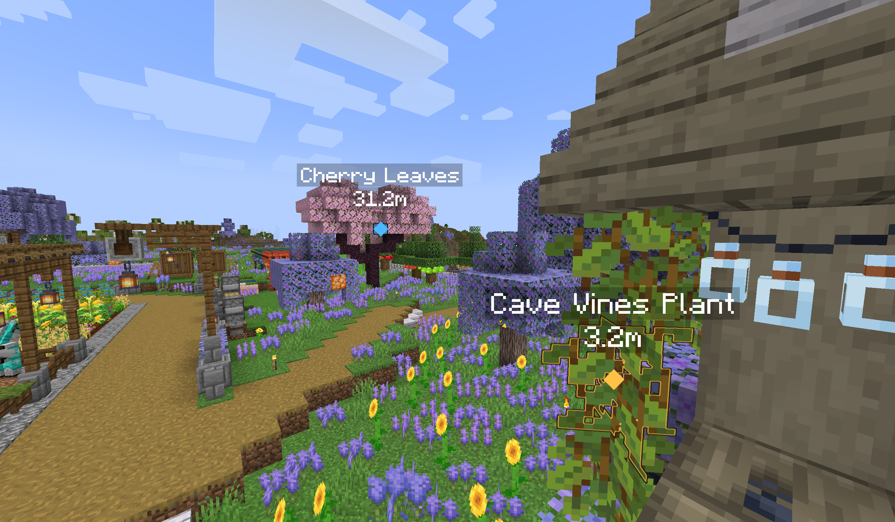

# Ping For It

Ping For It is a target-aware fork of Ping Wheel: point at a block or entity,
hold the ping key when a choice is needed, and show friends what you mean.



## Release

- Version: `0.2.0-pfi-beta1`
- Minecraft: `1.21.1`
- Java: `21`
- Loaders: Fabric, Forge, and NeoForge
- Mod ID: `pingforit`

## Pinging

The target and ray result are captured on the initial key press. The captured
entity, block, or pure location fallback is not retargeted while the
interaction is in progress. Entity identity follows the same-dimension entity;
block identity keeps its dimension, position, and block type.

There are seven predefined ping types: **Attention**, **Danger**, **Go To**,
**Loot**, **Destroy**, **Take**, and **Request**. A short press uses the
captured target type's default. Holding the key opens a wheel for that target's
available types; the center cancels the nearest eligible marker owned by you.
The wheel can also time out without taking an action.

Markers, target validation, ownership, shared-target winner selection, and rate
limiting are server-authoritative. The client only mirrors the server's create
rate policy as a courtesy; a throttled create is dropped rather than queued.

## Rendering

- Entity markers outline ordinary entities and dropped items using the selected
  ping color.
- Non-whitelisted blocks use their current native `VoxelShape`, including
  non-full-cube geometry, with a through-wall outline.
- The client block display whitelist defaults to `*:*`; the shape blacklist is
  empty by default. A blacklist match always overrides a whitelist match.
- Entries are strict `namespace:block`, `namespace:*`, `*:*`, or
  `#namespace:tag` patterns with union semantics. Invalid or missing entries
  fail closed.
- A whitelisted ordinary `block` needs no `BlockEntity` and a `MODEL` render
  shape. An `entity_block` has a `BlockEntity` and can use its renderer or
  live baked-model geometry before the VoxelShape fallback.
- Entity-block geometry modes are `ALL`, `COMPATIBLE`, and
  `VOXEL_SHAPE_ONLY`; the default is `COMPATIBLE`.

On NeoForge, optional Create `6.0.10` / Flywheel `1.0.6` support can render an
entity-block silhouette mask in `ALL` mode. It supports direct instancing and
indirect backends, loads lazily, and is a soft compile-only integration. It is
beta functionality; missing Create or Flywheel does not disable ordinary
pings.

## Languages

Eight bundled locales are supported: `en_us`, `de_de`, `es_ar`,
`fr_fr`, `pl_pl`, `tr_tr`, `zh_cn`, and `zh_tw`. Ping chat, target names,
settings, and wheel text use Minecraft localization.

## Controls and commands

| Action | Default |
| --- | --- |
| Ping | Mouse5 (rebindable) |
| Open settings | Unbound (rebindable) |

The ping key's short release sends the default type; holding it opens the
wheel. The wheel center is the cancel action, not another ping type.

- `/pingforit` or `/pingforit help` shows command help.
- `/pingforit config` opens the settings GUI. Its server section is available
  to permission-level-3 players and edits authoritative server settings.
- `/pingforit channel` reads or changes the player's ping channel.

## Configuration

The client file is `config/pingforit.json`; the server file is
`config/pingforit.server.json`. The settings GUI includes client controls and,
when permitted, the server section. It has no GUI list editor: its block-list
action saves and closes the screen before opening the client file.

Edit `blockDisplayWhitelist` and `blockShapeBlacklist` in the client file.
External list edits take effect after restarting the client; reopening settings
in the same session does not reload those files.

## Install, build, and verify

Install the jar for your loader and Minecraft `1.21.1`; Fabric also requires
Fabric API. Optional mods and registry content are soft dependencies.

From the repository root with JDK 21, build and verify the three loader jars:

```powershell
$env:GRADLE_OPTS = '-Dfile.encoding=UTF-8'
.\gradlew.bat --no-daemon build
.\gradlew.bat --no-daemon verifyModIdentity
```

## Beta status and attribution

This is a beta release. Rendering, multiplayer synchronization, optional
integration behavior, and hold/wheel interaction still need manual in-game
validation on supported loaders; build checks do not replace that validation.

The fork retains attribution to LukenSkyne's original Ping Wheel work. It has
its own identity and protocol, does not migrate the original protocol, does not
declare or enforce a conflict block against the original mod, and gives no
interoperability guarantee when both are installed.

## Special Thanks

- **LukenSkyne** and other Ping Wheel contributers for creating the original work
- **SHARK_oi** for providing this simple icon when I'm hesitating.
